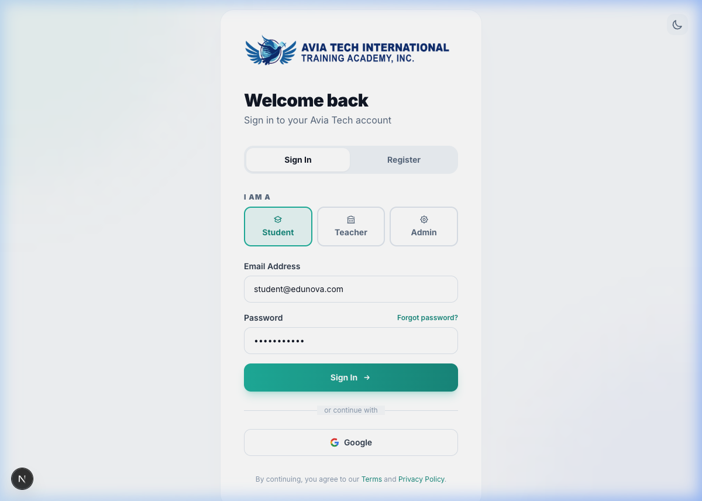
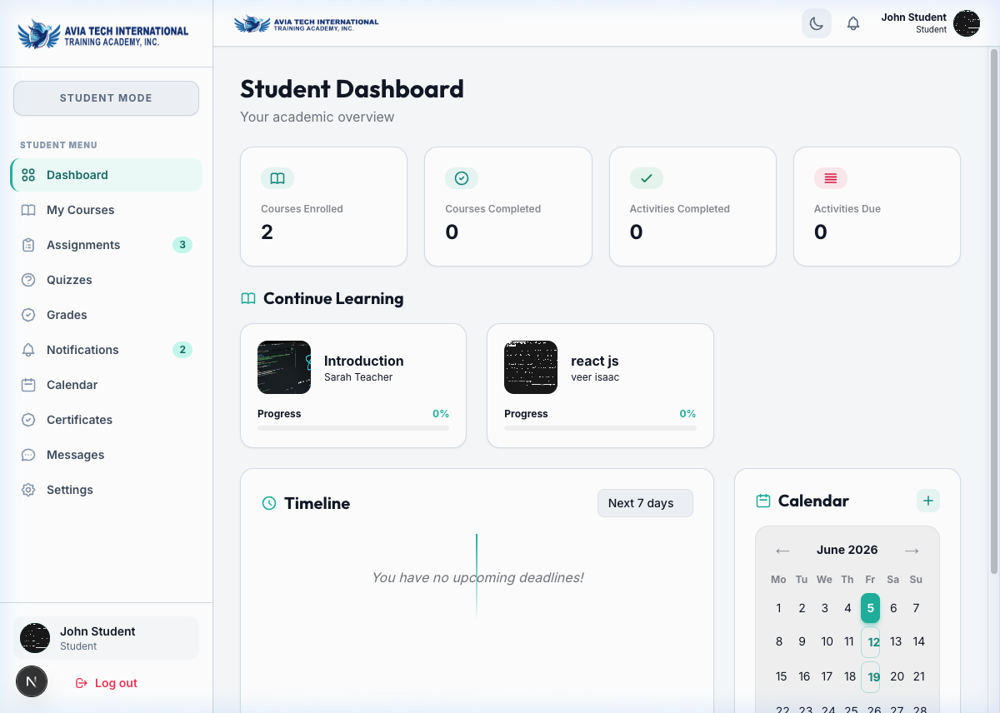
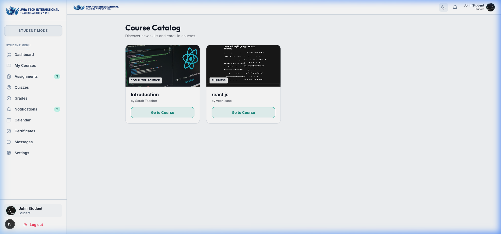
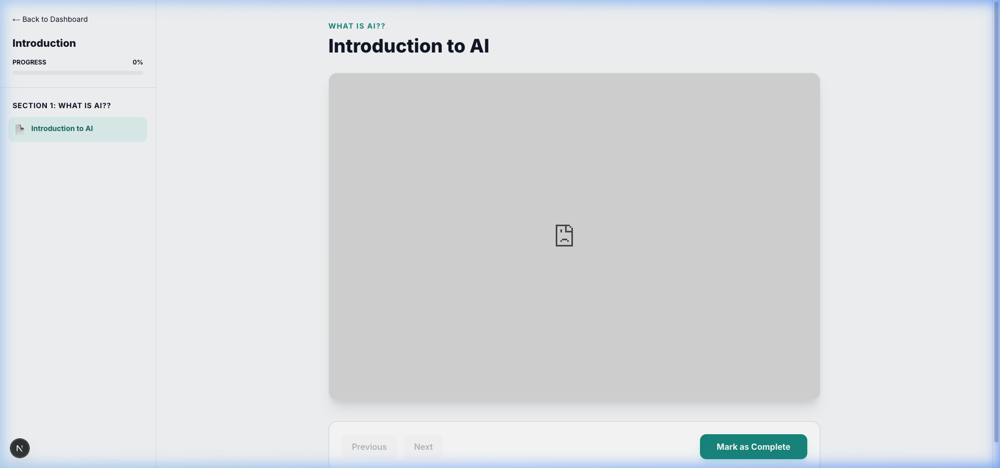
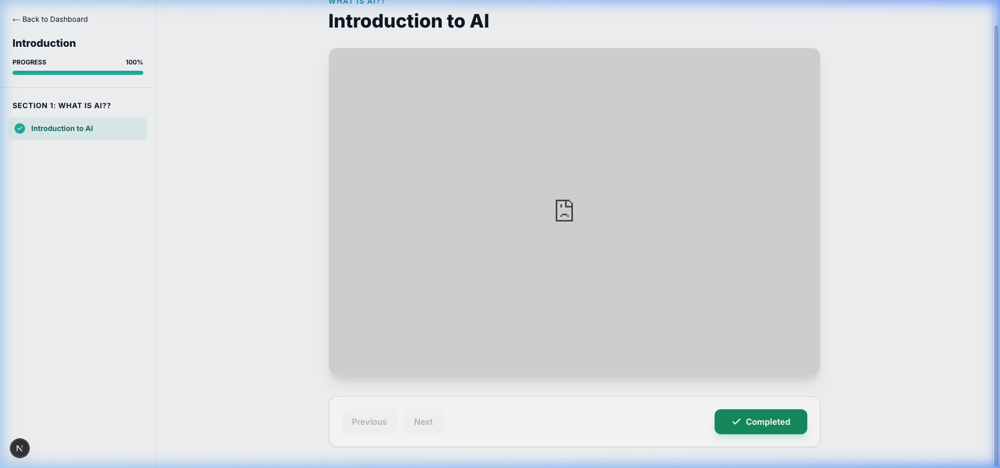
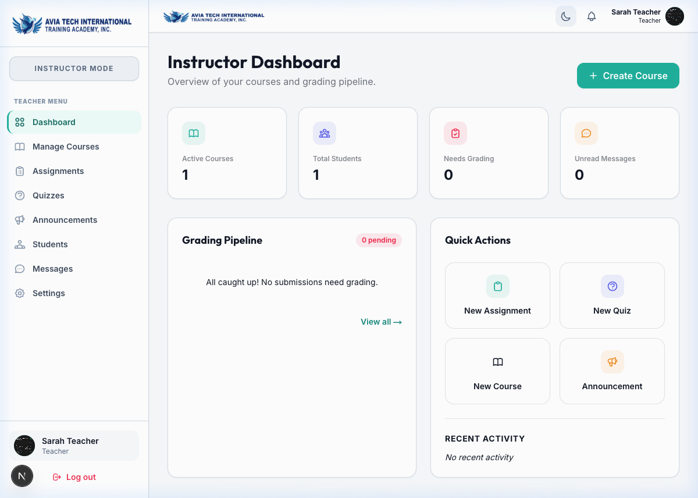
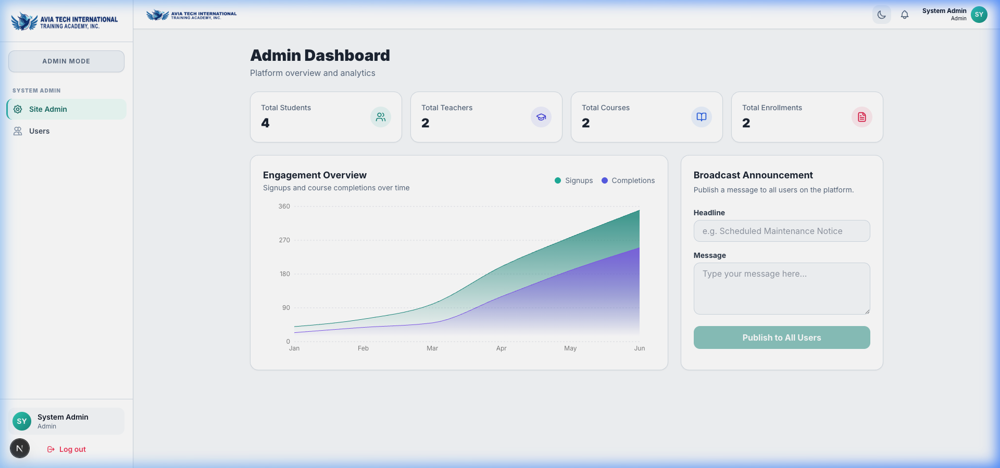

# LMS Web App Showcase & Screenshots

This directory contains screenshots of the EduNova LMS Web Application showing the user flows for Students, Teachers, and Admins.

---

## 1. Authentication
The login screen features styled typography, an elegant card design, and credentials for different roles.

* **Credentials:**
  - Admin: `admin@edunova.com`
  - Teacher: `teacher@edunova.com`
  - Student: `student@edunova.com`
  - Password: `password123`

---

## 2. Student Workflow
These screenshots walk through the student experience, from viewing their learning progress to browsing courses and taking lessons.

### A. Student Dashboard (Overview)
Shows progress, statistics, enrolled courses, and announcements.

### B. Course Catalog
Where students can browse and register for available classes.

### C. Course Learning Page
The main interface where students read lessons, watch videos, and review syllabus lists.

### D. Lesson Completion Page
Shows the curriculum sidebar updating immediately when a student marks a lesson complete.

---

## 3. Teacher Dashboard
Features metrics cards for students, assignments, and courses, along with announcement broadcast controls.

---

## 4. Admin Dashboard
Provides stats, signup engagement charts, and access to user management tools.

